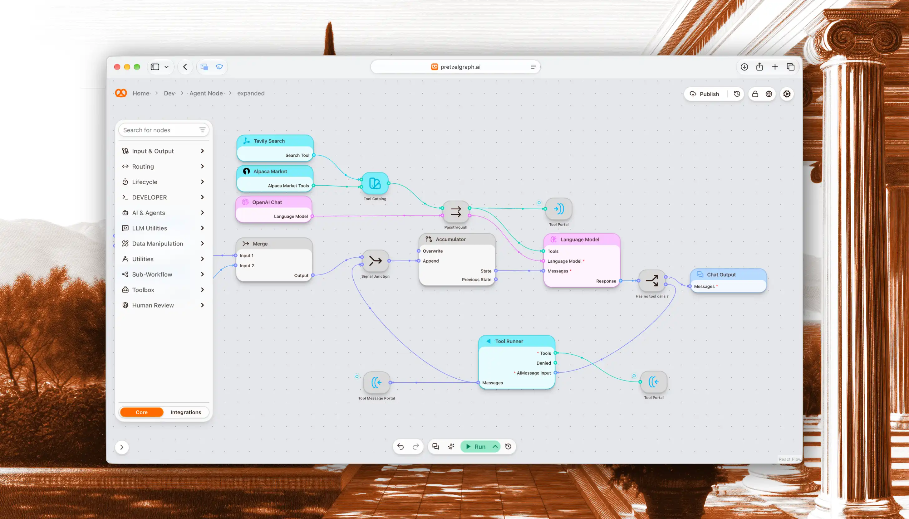

# PretzelGraph



A visual agent graph runtime. Build agents on a canvas, from a single ReAct
loop to multi-agent systems. Graphs can loop, so an agent can reason, call a
tool, and go again. Any workflow can be published and reused as a node in
another, so agents nest and compose.

## Running it

Requires Docker.

```bash
git clone https://github.com/RolandTeslaru/Pretzel-Graph.git
cd Pretzel-Graph
docker compose up -d            # http://localhost:8080
```

Open http://localhost:8080 and sign up.

### Developing

Requires Node as well.

```bash
docker compose up -d postgres redis gotrue
cp .env.example .env
npm install
npm run dev                     # http://localhost:5173
```

### Notes

- Ports `5432`, `6379` and `9999` must be free.
- The official node library is fetched from Pretzel Cloud. Set `PRETZEL_CLOUD_URL=`
  to turn it off.
- To use your own Postgres, point `DATABASE_URL` at an existing database.
- `PRETZEL_ENCRYPTION_KEY` must be 64 hex characters and the same for the backend
  and worker. Changing it makes stored credentials unreadable.

## License

[Elastic License 2.0](./LICENSE). Free to self-host; offering it as a hosted service requires a [commercial license](./COMMERCIAL-LICENSE.md).

## Contributing

Pull requests are welcome. Before your first one is merged, you'll be asked to
sign the [Contributor License Agreement](./CLA.md) by commenting on the PR.
