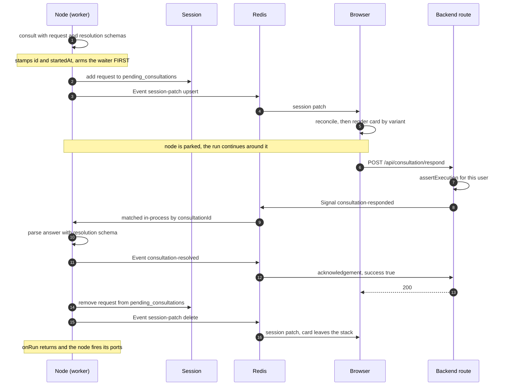

# Consultation Flow

How a running workflow asks the user for something, parks until it gets an answer, and resumes —
end to end, across the worker, backend, and browser.

A **consultation** is any point where a node cannot proceed without input that only a person (or an
external caller) can supply: an approval gate, a choice, a form, a webhook waiting for its first
request. All of them use one mechanism.

## Core model

- **`Consultation.Request`** — the ask. Carries `id`, `variant`, `nodeId`, `startedAt`, `timeoutMs`.
  Domains extend it with their own fields (`HumanReview.Request`, `Webhook.Test.Consultation.Request`).
- **`Consultation.Variant`** — an open registry of string tags, namespaced per domain
  (`human-review:confirm`, `webhook:payload`). A new node introduces a variant without editing any
  shared union; the browser resolves it to a card through a renderer registry.
- **`session.pending_consultations`** — the authoritative list of what a run is currently parked on,
  embedded in the execution's session blob. Everything the browser shows is a projection of this.
- **`Consultation.Resolution`** — the answer. Carries `requestId` and `variant`; domains extend it
  with the payload their node consumes.

Three message types are involved, and they travel on channels that already exist for the execution:

| Direction | Type | Channel | Purpose |
|---|---|---|---|
| worker → browser | `Execution.Event` `session:patch` | `execution:{id}` | Mirror the request onto, then off, the session |
| browser → worker | `Consultation.Signal.Responded` | `execution:{id}:signal` | Deliver the answer |
| worker → backend | `Consultation.Event.Resolved` | `execution:{id}` | Acknowledge that the answer was consumed |

---

## The full round trip



---

## Stage by stage

### 1. A node asks

```ts
const resolution = await this.context.consultationAPI.consult(
    HumanReview.Request.Confirm,   // request schema — parsed here
    { nodeId: this.nodeId, variant: HumanReview.Variant.Confirm, timeoutMs, ... },
    HumanReview.Resolution.Confirm // resolution schema — the answer is validated against it
);
```

`consult` stamps `id` and `startedAt` itself, so the node passes neither
(`UnstampedConsultationRequest` omits them from the argument type). The request schema is a
parameter rather than a fixed type, so each domain keeps its own fields all the way through.

### 2. The waiter is armed before the request is announced

`consult` calls `realtimeAPI.awaitSignalAfter(schema, match, timeout, action)`. The waiter is
registered **first**, and the `action` callback — which writes the session and emits the patch — runs
only once it exists. An answer arriving immediately therefore has no gap to fall into.

The `action` does two things:

1. `updateSession(d => { d.pending_consultations[id] = request })`
2. emits `Execution.Event.create("session:patch", { sessionPatch: { upsert: { pending_consultations: { [id]: request } } } })`

The session write is what makes the consultation durable; the event is what makes it immediate.

### 3. The browser projects it

`ExecutionSDK` is already subscribed to `execution:{id}`. The patch lands in
`session.applyPatch`, which merges `upsert` and then applies `delete`.

`ConsultationSDK` watches that slice and calls `reconcile`, which is idempotent: entries already in
the stack keep their slot, new ids append, vanished ids drop. The overlay looks up a renderer by
`variant` and renders the card. An unregistered variant falls back to a plain waiting card rather
than breaking the stack.

### 4. The user answers

The card calls `ExecutionSDK.actions.pendingConsultations.respond(consultationId, resolution)`,
which POSTs to `/api/consultation/respond`. The browser never publishes to Redis directly.

The route asserts execution ownership, then publishes `Consultation.Signal.Responded` onto
`execution:{id}:signal` and waits — up to 5s — for a `consultation:resolved` event carrying the
same `consultationId`.

### 5. The engine resumes

One signal channel serves the whole execution, so several parked nodes may see the same message.
Each waiter's `match` predicate narrows on `consultationId`, so exactly one resolves.

The node parses the answer with the resolution schema it supplied, emits `consultation:resolved`
(the route's acknowledgement), and returns it to `onRun`.

### 6. Cleanup

A `finally` block clears the entry from the session and emits a `session:patch` carrying a
`delete`. This runs on **every** exit path, not just success — a timeout or an abort leaves nothing
behind. Removal has to travel as an explicit delete because patches merge, and merging can never
drop a key.

---

## Authorization

The realtime gateway parses a channel as `{prefix}:{resourceId}[:...]` and resolves the owner from
the second segment. Both consultation channels are execution-prefixed with the execution id
second, so they authorize through execution ownership with no consultation-specific rule.

`consultationId` appears in message payloads, never in a channel name — it is a correlation key,
not an ownership boundary, and a channel suffix authorizes nothing.

---

## Endings other than an answer

| Ending | What happens |
|---|---|
| **Timeout** | The park rejects after `timeoutMs`. The `finally` clears the session entry, the card leaves the stack, and the node's error strategy applies. |
| **Terminate / suspend** | The execution's abort signal fires; every park bound to it rejects and unsubscribes. |
| **User leaves the page** | Nothing changes on the worker — it stays parked. The stack clears locally on detach. |
| **User returns mid-run** | `onAttach` replays from `session.pending_consultations`, rebuilding the stack. Because the countdown is anchored to the absolute `startedAt + timeoutMs`, the ring resumes mid-depletion rather than restarting. |
| **Run ends while parked** | The stack clears on `onStop`. Entries in a finished run's session are history, and are not rendered as answerable. |
| **Answer arrives with nothing parked** | The signal reaches no waiter, the acknowledgement never comes, and the route returns `{ success: false }` after 5s so the browser can surface the failure. |

---

## Adding a variant

1. Declare the tag with `Consultation.variant("domain:thing")` — this brands it while preserving the
   literal type, which is what lets an extending schema discriminate on it.
2. Extend `Consultation.Request` and `Consultation.Resolution`, pinning `variant` as a literal on
   both so a mismatched tag fails at parse.
3. Call `consultationAPI.consult` from the node with those two schemas.
4. Register a card for the tag with `ConsultationSDK.register(variant, renderer)`.

No shared union, channel, route, or event needs to change.
