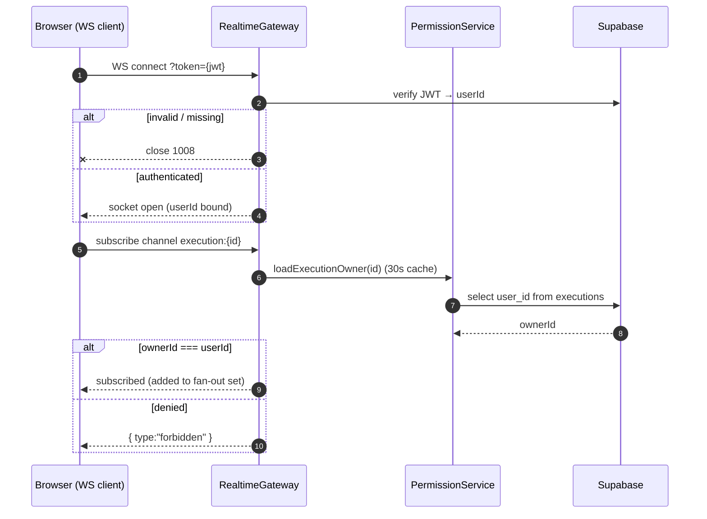
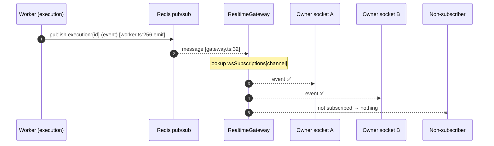
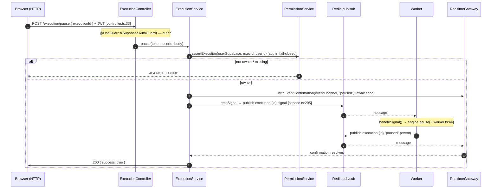
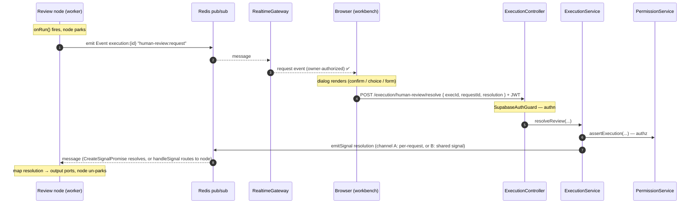

# Realtime Event & Signal Flow

How messages move between **workers** (running executions) and **browser clients**, in both
directions, and where authorization happens.

## Core model

- **Event** = engine → user. Downstream broadcast emitted by a worker, fanned out to all
  authorized subscribers of a channel.
- **Signal** = user → engine. Upstream control message sent by a client to the one worker
  holding a running execution.
- Both are just serialized `{ channel, type, ... }` objects (`Realtime.Event` / `Realtime.Signal.Base`).
- **They ride opposite-direction transports, bridged by Redis pub/sub:**
  - Event: `Redis → WebSocket` (push to browser)
  - Signal: `HTTP POST → Redis` (the WebSocket is **not** used upstream)

The WebSocket gateway is **downstream-only** — clients can only `subscribe` / `unsubscribe`.
There is no "publish a signal over the socket" path. Every upstream signal enters through an
authenticated HTTP route.

---

## Downstream: worker → client (Event)

First, the one-time subscribe handshake that establishes *who may receive*:

Then the broadcast itself — note the fan-out does **no** auth, it only pushes to sockets that
already subscribed:

### Authorization (who is allowed to receive)
Enforced once, at **subscribe time**, in `realtime.gateway.ts`:

1. **Connection** requires a Supabase JWT (`ws://…?token=<jwt>`); no/invalid token → socket
   closed (`handleConnection`, gateway.ts:62-83). Every socket carries a verified `userId`.
2. **Per-channel ownership** on each `subscribe` (`verifyChannelOwnership` → `queryOwnership`,
   gateway.ts:115-158):
   - `execution:<id>` → `PermissionService.loadExecutionOwner(id) === userId`
   - `chat:<id>`      → `PermissionService.loadChatOwner(id) === userId`
   - any other prefix → `denied`
3. Result cached per `userId:channel` for 30s. `not_found` is allowed (preemptive subscribe)
   and **not** cached.

The fan-out itself (gateway.ts:32-41) does **no** auth — it only pushes to sockets already in
`wsSubscriptions` for that channel. Authorization already happened at subscribe.

---

## Upstream: client → worker (Signal)

The client does **not** use the WebSocket. It makes an authenticated HTTP POST; the backend
authorizes and publishes onto the Redis signal channel the worker is listening on.

### Authorization (who is allowed to signal)
There is exactly **one** ingest gate: the HTTP route.

1. **`SupabaseAuthGuard`** (authn) — valid JWT or 401. (controller.ts, every signal route.)
2. **`PermissionService.assertExecution(userSupabase, execId, userId)`** (authz) — uses the
   caller's *own* token (RLS-scoped client) and throws `NOT_FOUND` if the row is missing or
   owned by someone else. (service.ts:198, identical preamble in `resume`/`heartbeat`/`suspend`/
   `terminate`.)
3. Only after both passes does `emitSignal` publish to Redis.

The browser can never publish to Redis directly, and the gateway exposes no publish action, so
the authenticated controller is the sole chokepoint for upstream.

### Round-trip confirmation
Signal routes turn fire-and-forget pub/sub into a synchronous response via
`realtime.withEventConfirmation(eventChannel, '<type>')` (service.ts:203): the backend subscribes
to the *event* the worker will echo back, emits the signal, then `await`s that event before
resolving the HTTP response and writing the DB. e.g. `pause` waits for the `paused` event.

---

## Why split the transports

- **Authz is natural on HTTP** — each signal is a discrete, individually guarded + ownership-checked request.
- **The WS gateway stays read-only** — clients can't inject onto the bus; no per-message publish
  authorization on a long-lived socket; smaller attack surface.
- **Redis decouples backend from worker** — the worker is a separate process/machine (BullMQ).
  Neither browser nor backend talks to it directly; they meet on named Redis channels.

---

## Channel grammar & ownership

**Every channel is `<prefix>:<resourceId>[:...]` — the resourceId is always the second
segment.** The gateway's `queryOwnership` extracts it with `channel.split(':')[1]`, so any trailing
qualifiers (`:signal`, `:resolved:<reqId>`, …) still resolve to the owning resource. Putting the
id anywhere else means it slices to a non-existent id → `not_found` → **silently allowed**. Don't.

**Prefix → ownership domain is a many-to-one map.** A prefix names *which loader* authorizes the
channel; several prefixes may share one domain. `human-review:` channels carry an `executionId`
and authorize via **execution** ownership — so they live off the already-overloaded `execution:<id>`
event channel without needing their own ownership table. See `queryOwnership`'s `loaders` map in
`realtime.gateway.ts`; adding a channel that authorizes via execution ownership is one line.

| Channel                                          | Direction | Authorizes via | Producer / Consumer | Defined in |
|--------------------------------------------------|-----------|----------------|---------------------|------------|
| `execution:<id>`                                 | down (event)  | execution | worker `emit()` → gateway → owner's sockets | `Execution.Event.getChannel` |
| `execution:<id>:signal`                          | up (signal)   | execution | backend `emitSignal` → worker `handleSignal` | `Execution.Signal.getChannel` |
| `chat:<id>`                                      | down (event)  | chat      | node `emit()` → gateway → owner's sockets | `Chat.Event.*` |
| `human-review:<execId>:sent`                     | down (event)  | execution | node `emit()` → gateway → owner's sockets | `HumanReview.Event.Sent.getChannel` |
| `human-review:<execId>:signal:resolved:<reqId>`  | up (signal)   | execution | backend route → worker `CreateSignalPromise` | `HumanReview.Signal.Resolved.getChannel` |

Note: only gateway-subscribed (downstream) channels are actually authorized by `queryOwnership`.
The upstream/worker-consumed channels (`:signal`, resolution) are guarded at their HTTP publish
route instead — but they still follow the segment-2 rule so a stray WS subscribe denies non-owners.

---

## Applying this to a Human-Review node

- **Request (engine → user)** = an **Event** the node `emit()`s on its **own** channel
  `human-review:<execId>:sent` (extends `Realtime.Event.Base`, so `emit` accepts it), kept off the
  already-overloaded `execution:<id>` event channel. The gateway authorizes it via **execution**
  ownership (the `human-review` prefix maps to `loadExecutionOwner`), so the workbench subscribes and
  only the execution's owner receives it — no new ownership table. (`HumanReview.Event.Sent`.)
- **Resolution (user → engine)** = a **Signal** on the dedicated per-request channel
  `human-review:<execId>:signal:resolved:<reqId>`, consumed by the node's `CreateSignalPromise`
  (matches the Webhook node). It enters through a **new authenticated HTTP route**
  (`POST /execution/human-review/resolve`) mirroring `pause`: `assertExecution` then `emitSignal`.
  The single authenticated HTTP chokepoint + `assertExecution` guards it.

End-to-end, a review pauses the node, surfaces a dialog via the event lane, and resumes via the
signal lane:

