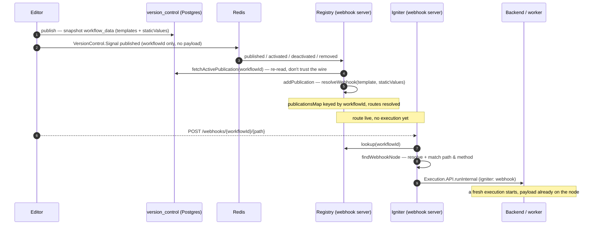

# Webhook Registration Flow

How a Webhook node's route — its `path` and `method` — reaches the internet-facing webhook server,
so that an inbound request can be matched to the right node.

A Webhook node declares its route with blueprint fields, usually as expressions rather than literals:

```ts
webhooks: [
    defineWebhook({
        id: "req",
        path: '${{ @fields["path"] }}',      // resolved from the node's `path` field
        method: '${{ @fields["method"] }}',  // resolved from the node's `method` field
    }),
]
```

Those `${{ ... }}` strings are **templates**, not values. Something has to turn them into a concrete
`webhook-abc123` / `POST` before a URL can be matched. There are two entirely different mechanisms
for doing that, and which one runs depends on whether the workflow is **published** or being
**tested** from the editor.

## The two paths at a glance

| | Published | Test |
|---|---|---|
| Inbound URL | `/<webhook-server>/webhooks/{workflowId}/{path}` | `/<webhook-server>/webhooks/test/{workflowId}/{path}` |
| How the route reaches the server | server **pulls** the whole published graph | execution **pushes** a register call |
| What carries `path`/`method` | raw `${{ }}` templates + `staticValues`, inside the publication snapshot | already-resolved concrete strings, in the register body |
| Who evaluates the templates | the webhook server (`resolveWebhook`) | the worker, before the node runs |
| Where it's stored | `publicationsMap`, lives with the publication | in-memory `Map`, one-shot, TTL'd |
| What an inbound request does | starts a fresh execution | answers a node already parked in a run |

The rest of this doc covers the **published** path. The **test** path's field-value delivery is
summarized at the end; its full round trip lives in
[webhook-test-flow.md](./webhook-test-flow.md).

---

## Published — the server pulls the graph and resolves it itself

Nothing is pushed per-node. When a workflow is published, its **entire `workflow_data`** — nodes,
`staticValues`, and each node's `webhooks[]` still holding the raw `${{ }}` templates — is
snapshotted into a `version_control` publication row. The webhook server reads that snapshot and
resolves the templates on its own side.

### 1. Publish writes a snapshot and announces it

Publishing creates a `version_control` row containing the full graph snapshot, then emits a
`VersionControl.Signal` (`published`) on Redis. The `path`/`method` templates are stored verbatim in
the snapshot — they are **not** evaluated at publish time.

### 2. The registry hydrates — on boot and on signal

`RegistrationService` (on the webhook server) keeps a `publicationsMap`, keyed by `workflow_id`,
current in two ways — and both read the same authoritative source, the DB:

- **On boot** — `initializeCache()` runs `select * from get_active_webhook_publications()` over a
  direct Postgres connection, parses each row into a `VersionControl.Publication`, and calls
  `addPublication`.
- **Live** — it is subscribed to `VersionControl.Signal.PATTERN_CHANNEL`. The signals carry **no
  publication payload** — a `published`/`activated` signal only names the workflow, so the server
  **re-reads** its active publication from the DB (`fetchActivePublication`, boot's query narrowed to
  one `workflow_id`) and replaces the entry; `deactivated`/`removed` just drops it. So the registry
  tracks publish/unpublish without a restart.

The signal is a nudge, not the truth: the DB is. This means a lost signal self-heals on the next boot
resync, and a forged one is inert — it can only trigger a re-read of legitimately-owned data, never
inject a route. It also collapses boot and live onto one read path.

### 3. `addPublication` resolves the templates

For each node carrying `webhooks`, `addPublication` calls `resolveWebhook(webhook, node,
staticValues)`. That runs `evaluateLegacyExpression` over each field against the node's
`staticValues`:

```
'${{ @fields["path"] }}'  +  staticValues["path"] = "webhook-abc123"   →  "webhook-abc123"
'${{ @fields["method"] }}' +  staticValues["method"] = "POST"          →  "POST"
```

This is the same resolver the editor uses to preview the URL, so the address a user copies and the
address the server matches come from one rule. The resolved publication is stored in
`publicationsMap`.

### 4. An inbound request is matched and starts an execution

```
POST /webhooks/{workflowId}/{path}
```

`WebhookIgniterController.receive` hands off to `WebhookIgniterService.handle`:

- `registry.lookup(workflowId)` → the publication (404 if none active).
- `findWebhookNode(publication, path, method)` — walks the publication's webhook nodes, resolves each
  again via `resolveWebhook`, and matches on `path` + `method` (405 if the path exists but the method
  doesn't).
- Builds an `Execution.Igniter` of variant `webhook` carrying the request payload, and calls
  `Execution.API.runInternal` — which **starts a fresh execution** of the published workflow.

A published webhook node never parks: the payload is placed on the node by `onWebhook` before `onRun`
runs. The inbound request is the *cause* of the run, not an answer to one.



### Where the credential fits

An HMAC signing credential declared on the webhook (`defineWebhook({ credential })`) rides this same
path automatically: it is part of `workflow_data`, so it is already in the publication snapshot the
registry pulls, sitting beside the `${{ }}` templates in `node.webhooks[]`. That is where an inbound
verification step would read it. The **test** path needs no such check — test payloads come from the
editor, not a third party.

---

## Test — the worker pushes resolved values

The mirror image. Here the templates are already gone by the time registration happens: running the
workflow in the editor resolves every field on the **worker**, so when the Webhook node reaches
`waitForTestPayload`, `this.fieldValues.path` / `.method` are concrete strings. The node **pushes**
them to the server:

```
Webhook node (worker) ──register {path, method, …}──▶ backend proxy ──▶ WebhookTestService.register()
        (concrete values, not templates)                                 stored in an in-memory Map
```

`resolveWebhook` never runs on the server for a test route — there is nothing left to resolve. The
register body carries the resolved `path`/`method` plus a TTL and the `executionId`/`consultationId`
the server hands back so the payload finds the parked node.

The registration hops, the guards, the one-shot dispatch, and the lifetimes are covered in
[webhook-test-flow.md](./webhook-test-flow.md).

---

## The one-line summary

- **Published:** templates travel *inside the published graph*; the **server** resolves them
  (`resolveWebhook`) on hydration and on match. An inbound request **starts** an execution.
- **Test:** the **worker** resolves the templates first; the running execution **pushes** the
  concrete values to the server. An inbound request **answers** an execution already parked.
