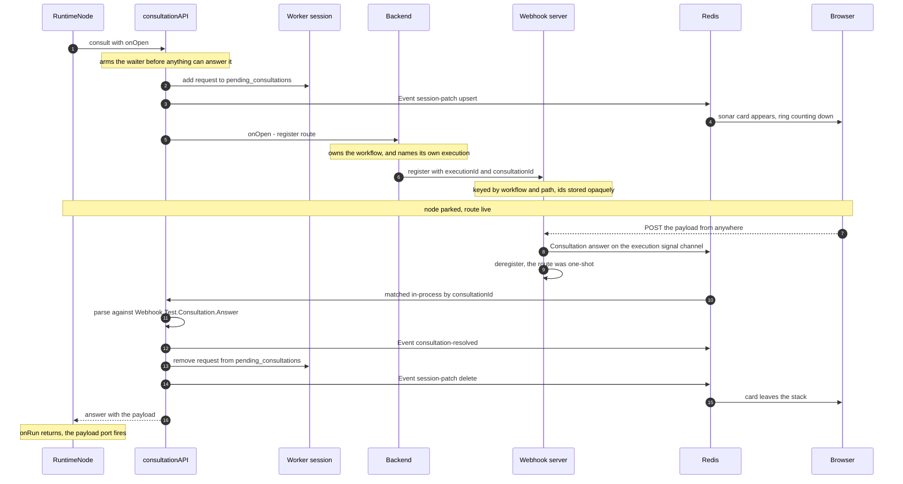

# Webhook Test Flow

How a Webhook node is exercised from the editor without publishing the workflow — the node parks,
a temporary public route is registered for it, and the first request to that route becomes the
node's payload.

How a route's `path`/`method` reach the server — and how the test path differs from a published one —
is covered in [webhook-registration-flow.md](./webhook-registration-flow.md).

This builds on the general mechanism in [consultation-flow.md](./consultation-flow.md). The parts
that are identical — arming the waiter, mirroring onto `session.pending_consultations`, rendering
the card, the `finally` that cleans up — are described there and only referenced here. What follows
is what makes the webhook case different: the answer arrives from **outside the browser**, via a
server that knows nothing about executions.

## Why there is a test mode at all

A published Webhook node never parks. It is an igniter: an inbound request starts the workflow, and
`onWebhook` puts the payload on the instance before `onRun` is reached.

Run the same workflow from the editor and no request started it, so there is no payload. `onRun`
sees `this.payload === null` and falls through to `waitForTestPayload()` — the node waits for a
request instead of having been caused by one.

## The URL, and what protects it

```
POST http://<webhook-server>/webhooks/test/{workflowId}/{path}
```

The webhook server is a **single shared instance** across users, so the route has to be reachable
by anyone holding the URL — no session, no bearer token. What keeps it private is that both
segments are unguessable: a UUID workflow id, and a 32-character path generated by the `path` field
(`FieldBuilder.UniqueString`). This is the same posture as a GitHub webhook URL or a Slack response
URL — possession of the URL is the credential.

Two things bound the exposure: the route is **one-shot** (deregistered the moment a payload
dispatches) and it **expires with the node's wait**.

`register` is guarded by `BackendGuard`; only `receive` is public, deliberately.

## Registration takes three hops

The node cannot call the webhook server directly — the worker only knows the backend's URL, and the
webhook server would have no way to authorize it. So:

**RuntimeNode → backend.** `POST /api/webhook/test/{workflowId}/register` behind `DelegateAuthGuard`,
carrying the execution token.

**Backend checks two things.** That the delegate owns the workflow in the path
(`assertDelegateWorkflow`), and that `body.executionId` is the delegate's *own* execution. Without
the second, a running execution could register a route that fires a payload into somebody else's
parked node.

**Backend → webhook server.** Forwarded with the `BACKEND_TOKEN_HEADER` shared secret, which is
what `BackendGuard` checks.

## The round trip



## What the server stores, and what it refuses to know

```ts
interface TestRegistration {
    workflowId, method, timer,   // this server's own concern
    executionId?, consultationId? // opaque — stored, echoed back, never interpreted
}
```

The registry is keyed by `${workflowId}/${path}`, and the URL is workflow-scoped. The webhook server
has no concept of an execution and does not acquire one: the two ids arrive with the registration,
sit in the map, and are handed straight back on the answer. That is what lets `dispatch` publish to
`execution:{executionId}:signal` without the server ever reasoning about executions.

The answer it publishes is a normal `Consultation.Signal.Answer` — the same envelope a human
clicking a card produces. Nothing downstream can tell the two apart, which is the point.

## Lifetimes

`testTimeoutMs` is a blueprint field (default 30s, min 10s, max 10min) and it drives **both** the
node's park and the registration's TTL, sent together in the register call. They expire as one, so
neither of these can happen:

- a route outliving its wait, accepting a payload with nobody parked
- a route expiring early, leaving the card saying "listening" while the URL 404s

## When it doesn't work

| Symptom | Cause |
|---|---|
| `404 No active test webhook registered` | The wait already timed out, or a payload already consumed the one-shot route, or the workflow was never run in test mode. |
| Card appears, payload returns 200, node never fires | The answer reached Redis but not the waiter. Compare the `consultationId` in the registry against the one in `pending_consultations`; the worker's scope also drops signals whose `executionId` doesn't match. |
| Node throws instead of parking | `onOpen` threw — registration failed. The waiter is unregistered rather than left parked, so the error surfaces immediately instead of as a timeout. |
| Payload logged as dropped by the server | The route was registered without `executionId`/`consultationId`, so there is no consultation to answer. See below. |

## Known gaps

`Core.Chat.Input` registers a test route while parking on its own signal rather than a consultation,
so it supplies neither id. `dispatch` logs and drops payloads for such a route. Both fields are
optional on the register body only to accommodate this; migrating that node onto a consultation
would let them become required.

There is no explicit deregister on an early exit. The TTL matching `testTimeoutMs` means the route
expires with the park rather than outliving it, so an explicit call would only make cleanup prompt
rather than eventual.
